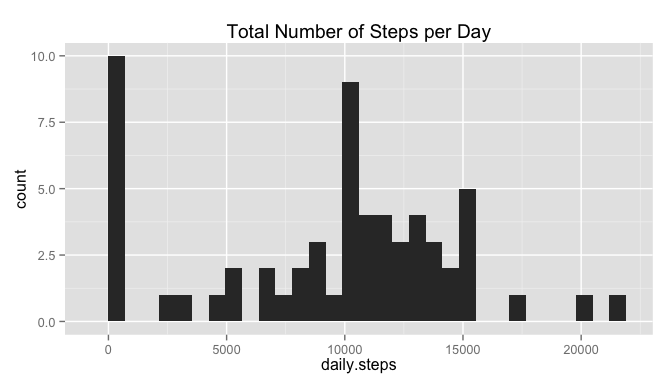
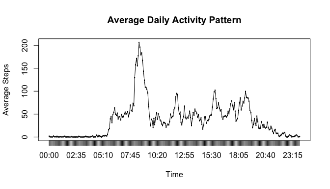
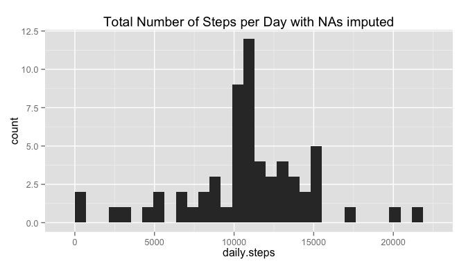
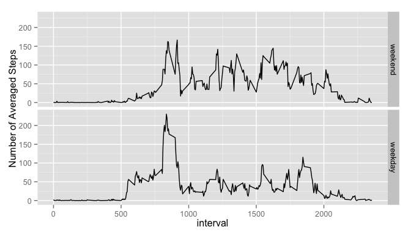

# Reproducible Research: Peer Assessment 1
EvenGu  


```r
## set global options to 1) supress package loading message and 2) format the numbers
library(knitr)
opts_chunk$set(message=FALSE, options(digits=2))
```

## Loading and preprocessing the data

```r
unzip(zipfile="activity.zip", overwrite=T)
dF <- read.csv("activity.csv",header=T)

library(ggplot2)
library(dplyr)
```


## What is mean total number of steps taken per day?

```r
dailySteps <- dF %>% group_by(date) %>%
  summarize(daily.steps=sum(steps,na.rm=TRUE))
meanTotal <- mean(dailySteps$daily.steps)
medianTotal <- median(dailySteps$daily.steps)
```
Here is the plot.

```r
qplot(daily.steps, data=dailySteps) + ggtitle("Total Number of Steps per Day")
```

 

**The mean total number of steps taken per day is 9354.23.**
**The median is 10395.**


## What is the average daily activity pattern?

```r
timeSteps <- dF %>% group_by(interval) %>%
  summarize(activity.pattern=mean(steps,na.rm=TRUE))
time <- sprintf("%04d",timeSteps$interval) 
timeSteps$time <- gsub('^(.{2})(.*)$', '\\1:\\2', time)
id <- which.max(timeSteps$activity.pattern)
```
Here is the plot.

```r
plot(as.factor(timeSteps$time), timeSteps$activity.pattern)
lines(as.factor(timeSteps$time), timeSteps$activity.pattern)
title(main="Average Daily Activity Pattern", xlab="Time", ylab="Average Steps")
```

 

**The time interval that contains the maximum number of steps, when averaged across all the days in the dataset, is from 08:30 to 08:35.**


## Imputing missing values

```r
naTotal <- sum(is.na(dF$steps))

## imputing NAs using the mean for that 5-minute interval across all the days
l=split(dF,as.factor(dF$interval))
for (i in 1:length(l)) {
  l[[i]]$steps[is.na(l[[i]]$steps)] = timeSteps$activity.pattern[i]
}
dF2 = unsplit(l,as.factor(dF$interval))

dailySteps.imput <- dF2 %>% group_by(date) %>%
  summarize(daily.steps=sum(steps))
meanTotal.imput <- mean(dailySteps.imput$daily.steps)
medianTotal.imput <- median(dailySteps.imput$daily.steps)
```
Here is the plot.

```r
qplot(daily.steps, data=dailySteps.imput) +
  ggtitle("Total Number of Steps per Day with NAs imputed")
```

 

**The total number of missing values (NA) in the dataset is 2304.**
**After imputing missing data, the mean total number of steps taken per day is 10766 and the median is 10766. They are different from the estimates of the first part of the assignment.**


## Are there differences in activity patterns between weekdays and weekends?

```r
dF2$days <- weekdays(as.POSIXct(dF2$date))
wDay <- c('Monday', 'Tuesday', 'Wednesday', 'Thursday', 'Friday')
dF2$weekday <- factor(dF2$days %in% wDay, 
         levels=c(FALSE,TRUE), labels=c('weekend', 'weekday'))

timeSteps2 <- dF2 %>% group_by(weekday,interval) %>%
  summarize(activity.pattern=mean(steps,na.rm=TRUE))
```
Here is the plot.

```r
qplot(x=interval, y=activity.pattern, data=timeSteps2, geom="line", facets=weekday~.) + 
  ylab("Number of Averaged Steps")
```

 


